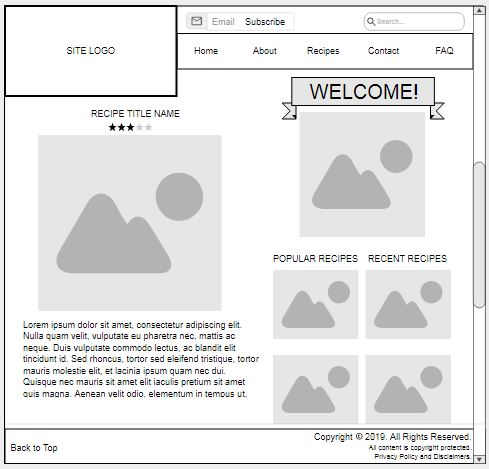
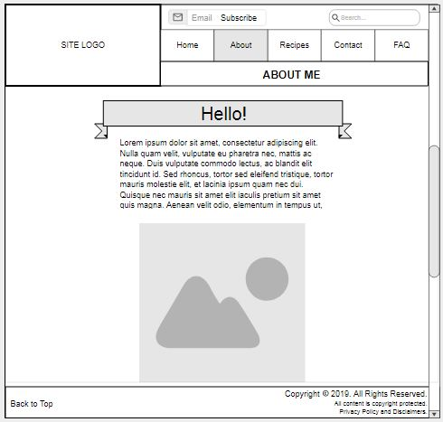
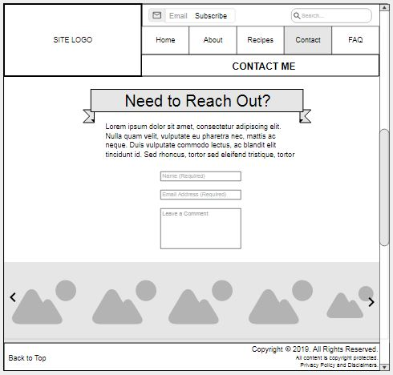

# My INF 7429 Project

I am going to build a food blog website. The main intended purpose of the project will be to develop a site that will showcase a variety of Keto recipes that I've tried, and created.

## Wireframes

When thinking about Information Architecture, and the creation of websites, I love creating wireframes to pre-plan the site's layout. Here are a few wireframes for what I have in mind with this site.

Header - the header will include my site logo, and the navigation menu. Above the latter will also be an area that allows users to search the site, and subscribe to receive notifications for when I update with a new post.  This will be the same on all pages.

Navigation Menu - this will include links to other pages available on the site, to include my About Me, Recipes, Contact, and Frequently Asked Questions pages.

Main Content - the homepage's content will include an introductory image, either of me, or of something special to me, beneath a welcome banner. Beneath that area, the right side of the page will draw the user's eye to other recipes featured on the site. They will likely include a list of Popular Recipes and Recent Recipes. The left portion of the page will include the newest recipe with a large picture of the finished item, and a small description beneath.  There would be a few other recipes beneath it, situated the same way.

Footer - the site's footer will include copyright information, as well as links to the site's privacy policy and list of disclaimers. Those will be right-aligned, while a link to move the user back to the top of the page will also be found in the footer, but left-aligned. This will be the same on all pages.

Header - the header will include my site logo, and the navigation menu. Above the latter will also be an area that allows users to search the site, and subscribe to receive notifications for when I update with a new post.

Navigation Menu - this will include links to other pages available on the site, to include my About Me, Recipes, Contact, and Frequently Asked Questions pages.

Main Content - The About Me page would be pretty straight forward, having a welcoming banner at the top, followed by an overview explaining who I am, and why I created the site, as well as what types of foods and recipes the site will feature. Beneath that will have a related picture, again, either of me, or something important to me such as my favorite recipe from the site.

Footer - the site's footer will include copyright information, as well as links to the site's privacy policy and list of disclaimers. Those will be right-aligned, while a link to move the user back to the top of the page will also be found in the footer, but left-aligned.

Header - the header will include my site logo, and the navigation menu. Above the latter will also be an area that allows users to search the site, and subscribe to receive notifications for when I update with a new post.

Navigation Menu - this will include links to other pages available on the site, to include my About Me, Recipes, Contact, and Frequently Asked Questions pages.

Main Content - The Contact page is pretty simplified, and will be a short paragraph telling visitors to put in their information in order to reach out to me, followed by a few entry fields for their name, email address, and a comment. I would prefer to keep it this simple until the site receives enough traffic for it to expand to include the likes of a Work With Me information, or other details. At the bottom of the page, above the footer, will be an image carousel feature which will show the display pictures of the more popular recipes available on the site.

Footer - the site's footer will include copyright information, as well as links to the site's privacy policy and list of disclaimers. Those will be right-aligned, while a link to move the user back to the top of the page will also be found in the footer, but left-aligned.
